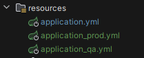

## Table of Contents

* ### [How to Run Locally](#how-to-run-locally)
* ### [Prerequisites](#prerequisites)
* ### [Build All Services](#build-all-services)
* ### [Build and Run Containers with Docker Compose](#build-and-run-containers-with-docker-compose)
  - [Add to `pom.xml`](#add-this-to-the-pomxml-for-dockerization)
* ### [Study Notes](#study-notes)
* ### [Steps to Run the Application](#steps-to-run-the-application)
  - [Delete Target Directory](#delete-the-contents-of-the-target-directory)
  - [Generate the JAR File](#generate-the-jar-file-using-maven)
  - [Run the Application with Java](#alternatively-run-the-application-directly-with-java)
* ### [Docker Instructions](#docker-instructions)
  - [Build the Docker Image](#build-the-docker-image)
  - [List Docker Images and Running Containers](#list-docker-images-or-running-containers)
  - [Run the Docker Container](#run-the-docker-container)
* ### [Stop and Remove Docker Containers](#stop-and-remove-docker-containers)
  - [Stop the Container](#stop-the-container)
  - [Remove the Container](#remove-the-container)
* ### [Building Docker Images with Spring Boot Maven Plugin](#building-docker-images-with-spring-boot-maven-plugin)
  - [Key Elements](#key-elements)
  - [Command to Build the Image](#command-to-build-the-image)
* ### [Google Jib](#google-jib)
* ### [Pushing images to Docker Hub](#pushing-images-to-docker-hub)
* ### [Using docker-compose file](#using-docker-compose-file)
* ### [Useful Docker Compose Commands](#useful-docker-compose-commands)
  - [Start services in the background (detached mode)](#start-services-in-the-background-detached-mode)
  - [Stop all running services](#stop-all-running-services-)
  - [Rebuild the services](#rebuild-the-services-useful-when-dockerfile-or-dependencies-change-)
   - [View logs for a specific service](#view-logs-from-running-services-)
  - [Scale a service](#scale-a-service-to-a-specific-number-of-instances-)
  - [Stop services without removing containers](#stop-services-without-removing-containers-)
  - [Remove stopped containers](#remove-stopped-containers)
  - [Execute a command inside a running service container](#execute-a-command-inside-a-running-service-container-)
  - [List containers associated with the compose project](#list-containers-associated-with-the-compose-project-)
  - [Pull the latest images for all services](#pull-the-latest-images-for-all-services-)
  - [Force recreation of containers](#force-recreation-of-containers-even-if-there-are-no-changes-)
  - [Start specific services](#start-specific-services)
  - [Remove containers, networks, and volumes](#remove-containers-networks-and-volumes-created-by-docker-compose-up-)
  - [Start interactive shell inside a container](#start-interactive-shell-inside-a-container-)
* ### [Useful Docker Compose Commands](#useful-docker-compose-commands)
* ### [Implementing profiles with Intellij](#implementing-profiles-with-intellij)
* ### [Refresh configurations at runtime using /refresh path](#refresh-configurations-at-runtime-using-refresh-path)
* ### [Using RabbitMQ as a message broker to share the config from Config Server](#using-rabbitmq-as-a-message-broker-to-share-the-config-from-config-server)


## How to run locally

### Prerequisites
* Java Development Kit (JDK) 23: Ensure that you have JDK 23 installed on your machine.
* Maven: Ensure that Apache Maven is installed for building the Java services.
* Docker: Ensure that Docker is installed for containerization.
* Docker Compose: Ensure that Docker Compose is installed for managing multi-container Docker applications.

### Steps to Run the Application

### Build All Services
First, we need to apply Spotless (for code formatting) and compile all services. To compile all Java services, run the 
`build-all-services.sh` script. This script will format the code using Spotless and package the services into JAR files.

```shell
./build-all-services.sh
```

### Create Docker Images
After all services are built (i.e., JAR files created), we can create the Docker container images by running the
`create-docker-images.sh` script:


```shell
create-docker-images.sh
```

After using **`./build-all-services.sh`** and **`create-docker-images.sh`** all services should've been compilated
and its images created

### Build and Run Containers with Docker Compose
After building the services, we can use Docker Compose to build and run the containers. Docker Compose will manage the
multi-container setup and networking.

Navigate to this path:
```shell
cd docker-compose/default
```
And trun this file:
```shell
docker-compose.yml
```
Run this command in a separate terminal:
```shell
docker run -it --rm --name rabbitmq -p 5672:5672 -p 15672:15672 rabbitmq:4.0-management
```

After building, creating the images and running, all services should be up and running. 

# Bellow are study annotations


### Generate the JAR file using Maven:

  ```bash
  mvn clean install
  ```

### Alternatively, run the application directly with Java:

  ```bash
  java -jar target/accounts-0.0.1-SNAPSHOT.jar
  ```

## Docker Instructions
Rodando os serviços em containers

### Build the Docker image:


  ```bash
 primeiro: docker build . -t marcossata/accounts:s4  
   ```

### List Docker images or running containers:

  ```bash
  docker images
  docker ps -a
   ```

### Run the Docker container:

  ```bash
  docker run -d -p 8080:9000 marcossata/accounts:s4
   ```

## Stop and Remove Docker Containers

### Stop the container:

  ```bash
  docker stop <container_id>
   ```

### Remove the container:

  ```bash
  docker rm <container_id>
  Or
  docker rmi <container_id> OR <container_name>

   ```

## Building Docker Images with Spring Boot Maven Plugin

This section explains how to configure the Spring Boot Maven plugin to build a Docker image of your application. By
specifying the necessary configuration, you can create a Docker image directly from Maven.

Maven Plugin Configuration
The following configuration in your pom.xml enables building a Docker image using the spring-boot-maven-plugin. The
build-image goal will be used to create an image based on the application’s properties and environment settings.

###  

  ```xml

<plugin>
    <groupId>org.springframework.boot</groupId>
    <artifactId>spring-boot-maven-plugin</artifactId>
    <configuration>
        <image><!-- This section configures the image creation -->
            <name>marcossata/${project.artifactId}:s4</name> <!-- Sets the name of the image -->
            <env>
                <BP_JVM_VERSION>${java.version}</BP_JVM_VERSION> <!-- Sets the Java version used in the image -->
            </env>
        </image>
    </configuration>
</plugin>
   ```

### Key Elements:

`<name>`: This tag specifies the name of the Docker image that will be built. It uses the artifact ID of your project,
which ensures that the image is named consistently with your project. In this case, the image name will be
marcossata/<artifactId>:s4.

`<env>`: This section allows you to pass environment variables to the build process. Here, we are setting the
BP_JVM_VERSION variable to use the Java version specified in the pom.xml.

### Command to Build the Image
To build the Docker image using the above configuration, run the following Maven command:


###  

  ```bash
  mvn spring-boot:build-image
   ```


## Google Jib
* First we add this dependency to our pom  
```xml
<plugin>
  <groupId>com.google.cloud.tools</groupId> <!--mvn compile jib:dockerBuild-->
  <artifactId>jib-maven-plugin</artifactId>
  <version>3.4.2</version>
  <configuration>
    <to>
      <image>marcossata/${project.artifactId}:s4</image>
    </to>
  </configuration>
</plugin>
   ```
* Run this command:
```bash
mvn compile jib:dockerBuild 
```

* Why use Google Jib?
  * It offers an alternative approach to Dockerfiles, with it, we can automatically generate production ready OCI images
  * from their application soure code without the need to write a Dockerfile and even local Docker setup


## Pushing images to Docker Hub
```bash
docker image push docker.io/<account_name>/<image_name>:<tag>

In my case:

docker image push docker.io/marcossata/loans:s4
```

## Using docker-compose file

```yaml
services:
    accounts:
        image: marcossata/accounts:s4 # Que subimos no Docker.io hub
        container_name: accounts-ms
        ports:
            - "8080:8080"
            #- Podemos definir várias portas para o serviço
        deploy:
            resources:
                 limits:
                     memory: 700m
        networks:
            - bankApplication # Rede interna que os serviços vão se comunicar

    loans:
        image: marcossata/loans:s4
        container_name: loans-ms
        ports:
            - "8090:8090"
        deploy:
            resources:
                limits:
                    memory: 700m
        networks:
            - bankApplication

    cards:
        image: marcossata/cards:s4
        container_name: cards-ms
        ports:
            - "9000:9000"
        deploy:
            resources:
                limits:
                    memory: 700m
        networks:
            - bankApplication
networks:
    bankApplication: # Rede interna que os serviços vão se comunicar
        driver: "bridge"
```

## Useful docker compose commands
### Start services in the background (detached mode):
  ```bash
  docker-compose up -d 
  ```
- 
### Stop all running services: 
  ```bash
  docker-compose down
  ```
### Rebuild the services (useful when Dockerfile or dependencies change): 
```bash
docker-compose up --build
```

### View logs from running services: 

```bash
docker-compose logs
```

### docker-compose logs <service_name> 
```bash
docker-compose logs <service_name>

 ```

### Scale a service to a specific number of instances: 
```bash
docker-compose up --scale <service_name>=<number>
 ```

### Stop services without removing containers: 
```bash
docker-compose stop
 ```

### Remove stopped containers:
```bash
docker-compose rm
 ```

### Execute a command inside a running service container: 
```bash
docker-compose exec <service_name> <command>
 ```

### List containers associated with the compose project: 
```bash
docker-compose ps
 ```

### pull the latest images for all services: 
```bash
docker-compose pull
 ```

### Force recreation of containers (even if there are no changes): 
```bash
docker-compose up -d --force-recreate
 ```

### Start specific services:
```bash
docker-compose up -d <service_name>
 ```

### Remove containers, networks, and volumes created by docker-compose up: 
```bash
docker-compose down --volumes
 ```

### Start interactive shell inside a container: 
```bash
docker-compose run <service_name> /bin/sh
 ```
## Implementing profiles with Intellij
1. Create the applications.yml


2. Add profiles to POM
   -
```xml
<!--you can copy here-->
	<profiles>
		<profile>
			<id>default</id>
			<activation>
				<activeByDefault>true</activeByDefault>
			</activation>
			<properties>
				<spring.profiles.active>default</spring.profiles.active>
			</properties>
		</profile>

		<profile>
			<id>qa</id>
			<properties>
				<spring.profiles.active>qa</spring.profiles.active>
			</properties>
		</profile>

		<profile>
			<id>prod</id>
			<properties>
				<spring.profiles.active>prod</spring.profiles.active>
			</properties>
		</profile>
	</profiles>
 ```

3. Add this do the principal application.yml
   -
```yaml
spring:
  profiles:
    active: @spring.profiles.active@
  config:
  import:
    - "application_qa.yml" # these are the names of the application_X.yml that we've created
    - "application_prod.yml"
```
 
4. Now we can select the profile
   - Always reload the project after changing a profile


### Refresh configurations at runtime using refresh path
1 - To add refresh configuration at runtime using /refresh path we'll need to add **Actuator** to our project.
2 - Enable /refresh API: The spring Boot Actuator library provides a configuration endpoint called **"/actuator/refresh"**
that can trigger a refresh event. By default, this endpoint is not exposed, so we need to explicitly enable it in 
application.yml file using the below config:
```yaml
management:
  endpoints:
    web:
      exposure:
        include: refresh
```

### Using RabbitMQ as a message broker to share the config from Config Server
Spring Cloud Bus and RabbitMQ

1 - Update services and **Config Server**with this dependency:
```xml
		<dependency>
			<groupId>org.springframework.cloud</groupId>
			<artifactId>spring-cloud-starter-bus-amqp</artifactId>
		</dependency>
```
Add this configuration to the services applcation.yml:
```yaml
spring:
    rabbitmq:
        host: "localhost"
        port: 5672
        username: "guest"
        password: "guest"
```
Install RabbitMq image
```dockerfile
# latest RabbitMQ 4.0.x
docker run -it --rm --name rabbitmq -p 5672:5672 -p 15672:15672 rabbitmq:4.0-management
```

With the image and RabbitMQ server running, run Config Server


## How Dynamic Configuration Updates Work with Spring Cloud Config Server and RabbitMQ

In this setup, you are using a **Spring Cloud Config Server** to centralize the configuration of different microservices. The configurations are stored in a Git repository, and **RabbitMQ** is used for communication between services via **Spring Cloud Bus**, which synchronizes configuration changes across services.

### 1. Config Server and Git Repository
- The **Config Server** is a centralized service that holds configurations for other microservices.
- These configurations are stored in a Git repository, as defined in our config server `application.yml`:
    ```yaml
    spring:
      cloud:
        config:
          server:
            git:
              uri: "https://github.com/Marcosxx1/config-server-files.git"
              default-label: main
    ```
  - The Config Server reads the configurations from Git and serves them to the other microservices as needed.

## 2. Spring Cloud Bus and RabbitMQ
- **Spring Cloud Bus** is used to synchronize configuration changes across all microservices. It uses **RabbitMQ** to send event messages about changes.
- We've configured **RabbitMQ** in our config server `application.yml` with the following settings:
    ```yaml
    rabbitmq:
      host: "localhost"
      port: 5672
      username: "guest"
      password: "guest"
    ```
  - **RabbitMQ** acts as a messaging system that allows services to listen for events from **Spring Cloud Bus**.

## 3. How Configuration Updates Work
The dynamic configuration update process happens as follows:

### a) Initial Service Configuration
- When a microservice starts, it connects to the **Config Server** to fetch its configuration.
- This allows for centralized and standardized configuration across different services.

### b) Configuration Changes
- When we make a change in the Git repository (where the configurations are stored), those changes are not automatically applied to the microservices. We need to notify the services about the change.

### c) Using the `/actuator/refresh` Endpoint
- To apply the changes, we make an HTTP request to the `/actuator/refresh` endpoint of one of the microservices:
    ```bash
    http://localhost:8090/actuator/refresh
    ```
  - This endpoint triggers **Spring Cloud Bus**, which sends a message to RabbitMQ informing all the microservices that the configuration has been updated.

### d) Propagation of Changes via RabbitMQ
- **RabbitMQ** propagates the configuration change event to all microservices connected to Spring Cloud Bus.
- Each microservice that receives the event checks the **Config Server** for the updated configurations. This happens dynamically without restarting the services.

### e) Dynamic Reloading
- Microservices listening to the **Spring Cloud Bus** event use the **@RefreshScope** feature in Spring to reload configurations. Any class or component annotated with `@RefreshScope` will be automatically reloaded with the new configurations after the refresh event.

## Summary of the Flow:
1. The Config Server loads configurations from a centralized Git repository.
2. These configurations are provided to microservices at startup.
3. When you change the configurations in Git and call the `/actuator/refresh` endpoint, Spring Cloud Bus sends a message via RabbitMQ.
4. The microservices listen to the message, check the Config Server, and reload the configurations dynamically.

## Benefits:
- **Centralization:** All configurations are centralized in the **Config Server** and can be changed without manually modifying each service.
- **Automatic Synchronization:** **Spring Cloud Bus** with RabbitMQ ensures that all services receive updated configurations efficiently and without restarting.
- **Scalability:** This works well in production environments where you might have multiple instances of microservices and want to ensure all receive updates simultaneously.
